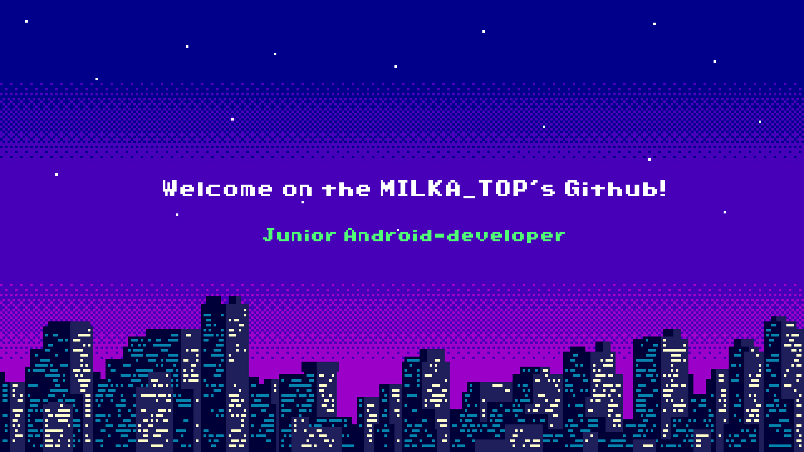

💻 Hi, I am a 2nd year 🎓 *[ITMO Computer Science]* 🎓 student studying ***Android development*** and ***Java / Kotlin***.

✨ Here you can find my various pet-projects: Mobile apps, telegram bots, labs and homeworks assignments from the courses 😉

## Technical skills

## GitHub stats

 

## Contacts

🌐 Telegram: https://t.me/MILKAsuper

✉️ E-Mail: svakun@gmail.com

📞 Phone: +79215830737

